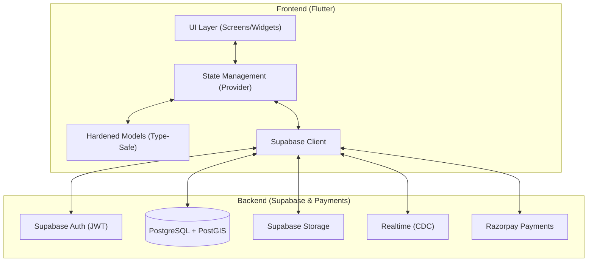

# 🚀 ProConnect: The AI-Powered Local Service Ecosystem

ProConnect is a premium, high-performance marketplace platform designed to bridge the gap between skilled service providers and local customers. Built with an "Architecture-First" mindset, it leverages **Flutter**, **Supabase**, and **Razorpay** to deliver a real-time, geospatial-aware, and intelligent service discovery experience.

---

## 💎 The "Wow" Factor: System Intelligence

### 📊 Business Insights (Phase 3)
Providers now have access to a sophisticated analytics engine. 
- **Growth Tracking**: Real-time charts (`fl_chart`) showing earnings, booking volume, and profile engagement.
- **KPI Dashboard**: Instant visibility into conversion rates, average ratings, and market presence.

### 🗺️ Demand Heatmap (Liquidity)
A geospatial tool allowing providers to find high-activity zones.
- **Dynamic Heatmap**: Red-to-Yellow clusters based on recent service searches and bookings nearby.
- **Liquidity Optimization**: Helps providers move to high-demand areas to maximize their business potential.


### 🤖 Smart Events Engine (AI-Ready)
- **Behavioral Tracking**: Every interaction (app open, search, click) is logged with JSONB metadata to train future recommendation models.
- **Personalized Recommendations**: AI-powered placeholders in the home screen for highly-relevant service suggestions.

---

## 🔄 User Retention & Engagement (Phase 2)

### 💰 Wallet & Referral System
- **In-App Wallet**: Securely manage credits for payments and rewards.
- **Viral Growth**: Reward-based referral system (₹50 for referrer, ₹25 for referee) to drive platform growth.

### 🔔 Smart Notification System
- **Real-time Alerts**: Never miss a booking update or message with in-app notifications and deep-linking.
- **System Automation**: Automatic alerts for payment success, booking confirmations, and provider availability.

---

## 🏛️ Premium Architecture

ProConnect follows a **BaaS-Native Architecture**, maximizing efficiency by removing traditional backend bottlenecks.



---

## ✨ Features at a Glance

### 👤 Customer Experience
- **Precision Geolocation**: Find providers within your exact radius.
- **Secure Payments**: Frictionless Razorpay integration with advance/settlement flows.
- **Verified Reviews**: Authentic ratings with multi-media support.
- **Search v2**: Blazing fast search results using GIN Trigram indexes.

### 🛠️ Provider Management
- **Professional Suite**: Manage jobs, schedules (Mon-Sun), and service areas.
- **Portfolio Showcase**: High-visual gallery to attract top-tier customers.
- **Trust Badge**: Secure identity verification workflow for "Verified Provider" status.

### 🛡️ Admin Command Center
- **System Metrics**: Overview of platform health, earnings, and user growth.
- **Moderation**: Complete control over categories, providers, and community reviews.

---

## 🚦 Quick Start

### 1. Supabase Setup
- Run SQL migrations in `./supabase/migrations/` sequentially.
- Enable **PostGIS** extension.
- Create storage buckets: `avatars`, `portfolios`, `verifications`.

### 2. Run the App
```bash
cd frontend
flutter run --dart-define=SUPABASE_URL=YOUR_URL --dart-define=SUPABASE_ANON_KEY=YOUR_KEY
```

---

Built with ❤️ by the ProConnect Team.
🚀 *Modernizing the way people find help, one pin at a time.*
