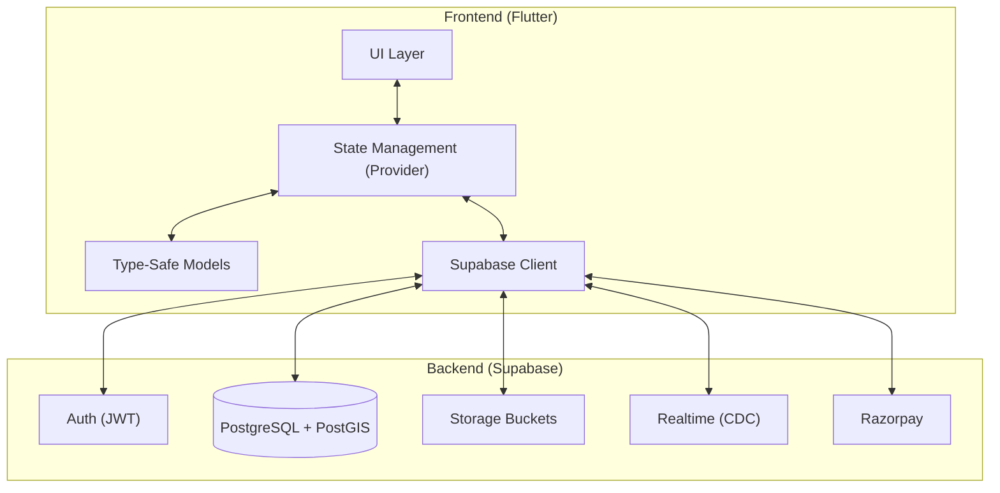

# 🚀 ProConnect: A Smart Local Service Marketplace

ProConnect is a modern, scalable marketplace platform that connects **local service providers** with **customers** through a real-time, geospatial-aware system. Built with an **architecture-first approach**, it leverages **Flutter**, **Supabase**, and **Razorpay** to deliver a fast, reliable, and extensible service experience.

---

# 🎯 Why ProConnect?

Unlike traditional service apps, ProConnect focuses on **speed, reliability, and provider empowerment** at a local level.

* ⚡ **Faster Matching**: Optimized provider availability + retry system ensures quicker bookings
* 📍 **Hyperlocal Discovery**: Accurate radius-based search powered by PostGIS
* 🔁 **Reliable Booking Flow**: Built-in retry & fallback system prevents failed bookings
* 📊 **Provider Empowerment**: Analytics + demand heatmaps help providers grow their business
* 💰 **Flexible Payments**: Advance + settlement model ensures trust for both sides

---

# 💎 Key Capabilities

## 📍 Precision Geolocation Engine

* Radius-based provider discovery using **PostGIS**
* Real-time provider tracking during active bookings
* Interactive map picker with reverse geocoding

---

## 🔄 Reliable Booking System

* Structured lifecycle:
  `Pending → Accepted → In Progress → Completed / Cancelled`
* Automatic retry & reassignment system
* Optimistic UI for instant feedback

---

## 💸 Secure Payment Flow

* Integrated with **Razorpay**
* Advance (20%) + final settlement (80%) model
* Payment state tracking with failure handling

---

## 🔔 Engagement & Retention System

* In-app notification center with deep linking
* One-tap rebooking for repeat services
* Referral system with wallet-based rewards

---

## 📊 Provider Intelligence Tools

* Earnings and performance analytics dashboard
* Booking trends and rating insights
* Demand heatmap to identify high-activity zones

---

## 🧠 Data-Driven Foundation (AI-Ready)

* Event tracking for user behavior (search, clicks, bookings)
* Structured data collection using JSONB metadata
* Designed to support future recommendation systems

---

# 🏛️ Architecture Overview

ProConnect follows a **BaaS-native architecture**, eliminating the need for a traditional backend server while maintaining scalability and security.



---

# ✨ Feature Overview

## 👤 Customer Experience

* Smart service discovery with fast search
* Real-time booking and provider tracking
* Secure payments and transparent flow
* Verified reviews with media support

---

## 🛠️ Provider Experience

* Business dashboard with analytics
* Availability and service radius control
* Portfolio showcase for credibility
* Demand heatmap for better positioning

---

## 🛡️ Admin Control

* Platform-wide metrics and insights
* Provider verification workflows
* Category and content management

---

# 🚦 Quick Start

## 1. Supabase Setup

* Run SQL migrations from `./supabase/migrations/`
* Enable **PostGIS extension**
* Create storage buckets:

  * `avatars`
  * `portfolios`
  * `verifications`

---

## 2. Run the App

```bash
cd frontend
flutter run --dart-define=SUPABASE_URL=YOUR_URL --dart-define=SUPABASE_ANON_KEY=YOUR_KEY
```

---

# 🧠 Design Philosophy

ProConnect is built on three core principles:

* **Reliability First** → Systems handle failures, retries, and edge cases
* **User Efficiency** → Minimize friction (fast booking, rebooking)
* **Scalable Foundation** → Designed to support growth and future AI integration

---

# 🚀 Roadmap

* 📱 Push notifications (FCM integration)
* 🤖 Advanced recommendation engine
* 🌍 Multi-city expansion support
* 📊 Deeper analytics & insights

---

# 🏁 Final Note

ProConnect is not just a feature-rich app — it is a **system designed to operate reliably in real-world conditions**, with a strong foundation for scaling and future intelligence.

---

Built with ❤️ by the ProConnect Team
🚀 *Connecting people to trusted services, faster and smarter.*
