# 🚀 ProConnect: The AI-Powered Local Service Ecosystem

ProConnect is a premium, high-performance marketplace platform designed to bridge the gap between skilled service providers and local customers. Built with an "Architecture-First" mindset, it leverages **Flutter** and **Supabase** to deliver a real-time, geospatial-aware, and intelligent service discovery experience.

---

## 💎 Special Features (The "Wow" Factor)

### 📍 Precision Geolocation (PostGIS Powered)
Unlike traditional apps that just show a map, ProConnect uses **PostgreSQL PostGIS** at the database level. 
- **Radius Search**: Customers find providers within a dynamic `X km` radius.
- **Real-time Tracking**: Providers sync their live coordinates, visible to customers during active bookings.
- **Map Picker**: Integrated interactive map for manual service location pin-pointing.

### 🤖 Smart AI Foundations
- **Personalized Discovery**: A server-side recommendation engine (PL/pgSQL RPC) analyzes user booking history and global trends to suggest the most relevant categories.
- **Intelligence at the Edge**: Non-blocking AI UI that provides immediate category suggestions on the home screen.

### 🛡️ Zero-Trust Security (Supabase RLS)
- **Hardened RLS**: Every single table in ProConnect is protected by hardened **Row-Level Security** policies. 
- **Direct-to-DB**: The frontend communicates directly with Supabase, eliminating traditional backend bottlenecks while maintaining bank-grade data isolation.

### ⚡ Optimistic UI & Real-time Sync
- **Messaging Hub**: Sub-second latency for in-app chat using Postgres CDC (Change Data Capture).
- **Infinite Feel**: State management (Provider) ensures status updates (Accept/Start/Complete) reflect instantly in the UI.

---

## 🏛️ Perfect Architecture

ProConnect follows a **BaaS-Native Architecture**, maximizing efficiency by removing the "Middle-Man" server.

```mermaid
graph TD
    subgraph "Frontend (Flutter)"
        UI["UI Layer (Screens/Widgets)"]
        Prov["State Management (Provider)"]
        Models["Hardened Models (Type-Safe)"]
        SBC["Supabase Client"]
        
        UI <--> Prov
        Prov <--> Models
        Prov <--> SBC
    end

    subgraph "Backend (Supabase/PostgreSQL)"
        Auth["Supabase Auth (JWT)"]
        DB[("PostgreSQL + PostGIS")]
        Store["Supabase Storage (Buckets)"]
        RT["Realtime (CDC/WebSockets)"]
        
        SBC <--> Auth
        SBC <--> DB
        SBC <--> Store
        SBC <--> RT
    end

    subgraph "Architecture Patterns"
        P1["Repository-less (Direct PostgREST)"]
        P2["Security-at-Rest (RLS)"]
        P3["Geo-Logic (DB RPCs)"]
    end
```



---

## ✨ Comprehensive Feature Matrix

### 👤 Customer Experience
- **Smart Discovery**: AI-driven "Recommended for You" categories.
- **Global Search**: Instantly find providers by name, skill, or service area.
- **Booking Lifecycle**: Full-stack management from request to completion.
- **Media-Rich Reviews**: Submit ratings with multi-image support.
- **Deep Linking**: Magic links for secure, one-tap email confirmation.

### 🛠️ Provider Management
- **Business Suite**: Real-time dashboard for active/pending job management.
- **Portfolios**: Showcase skills with a high-visual media gallery.
- **Availability Engine**: Fine-grained weekly schedule control (Mon-Sun).
- **Service Radius**: Define a custom work area (km) to filter leads.
- **Identity Verification**: Secure document upload workflow for verified badges.

### 🛡️ Admin Command Center
- **Statistics**: Platform-wide health metrics (active users, liquidity).
- **Onboarding**: Interface for verifying provider documents and portfolios.
- **Integrity**: Manage categories and moderate community feedback.

---

## 📂 Project Anatomy

```text
proconnect/
├── frontend/lib/
│   ├── models/        # Strict JSON-to-Dart mapping
│   ├── providers/     # Global state & stream observers
│   ├── services/      # AI, Geo, and Supabase Glue
│   ├── widgets/       # Atomic UI components
│   └── screens/       # Role-based feature folders
│
├── supabase/migrations/ # Version-controlled DB evolution
│   └── 017_smart_recommends.sql # AI logic
│
└── admin-dashboard/     # React-styled Premium Admin Panel
```

---

## 🚦 Quick Start

### 1. Database
- Enable **PostGIS** in your Supabase project.
- Create buckets: `avatars`, `portfolios`, `id-verifications`.
- Run all SQL migrations in `./supabase/migrations/` sequentially.

### 2. Frontend
```bash
cd frontend
flutter run --dart-define=SUPABASE_URL=YOUR_URL --dart-define=SUPABASE_ANON_KEY=YOUR_KEY
```

---

Built with ❤️ by the ProConnect Team.
🚀 *Modernizing the way people find help, one pin at a time.*
